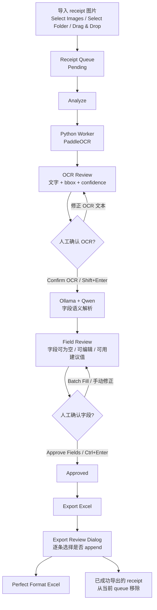
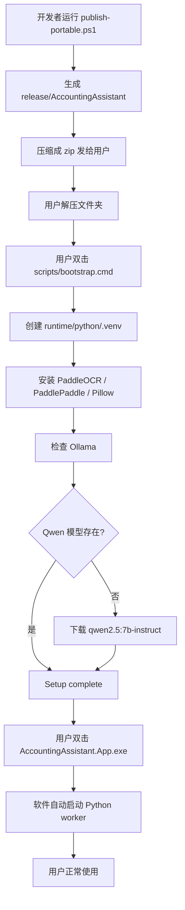

# Accounting Assistant

Accounting Assistant 是一个 Windows-first 的本地票据审核与 Excel 录入工具。

它的目标不是做万能 Excel 适配器，而是做一个可控、可审核、尽量降低误写风险的本地会计录入工具。

## 主流程



## 当前能力

- Windows WPF 桌面端 UI。
- 支持选择图片、选择文件夹、拖拽导入图片。
- 支持 `.jpg/.jpeg/.png` receipt 图片。
- 启动时自动 warmup OCR worker。
- 使用 PaddleOCR 进行 OCR。
- OCR 结果带 confidence 和 bbox，可在图片上高亮。
- OCR 文本可人工双击修正。
- Confirm OCR 后调用本地 Ollama/Qwen 做字段语义解析。
- 字段允许为空，允许人工编辑。
- 支持常用建议值 ComboBox。
- 支持 Batch Fill。
- 支持管理常用建议值。
- 支持字段冲突提示。
- 支持手动 Sort Queue。
- 支持导出 Approved receipts 到 Perfect Format Excel。
- 导出前会打开逐条审核窗口，重复单号默认不勾选。
- 成功导出的 receipt 会从当前 queue 移除。

## 项目结构

```text
Accounting-Assistant/
  app/
    AccountingAssistant.App/       # C# WPF 桌面 UI
  worker/
    accounting_worker/             # Python OCR / semantic worker
    tests/                         # Python contract tests
  data/
    project_profile.json           # 项目级常用建议值
  docs/                            # 开发与配置文档
  scripts/
    bootstrap.cmd                  # 首次安装入口，给普通用户双击
    bootstrap.ps1                  # 创建 venv、安装依赖、检查 Ollama/Qwen
    publish-portable.ps1           # 生成 portable 发布包
  samples/                         # 本地测试图片，git ignore
  exports/                         # 本地导出文件，git ignore
  requirements.txt                 # Python worker 依赖
  首次安装指南.md                   # 面向普通用户的安装说明
```

## 运行依赖

开发机需要：

- Windows
- .NET 10 SDK
- Python 3.11 或 3.12
- Ollama
- Qwen 模型：`qwen2.5:7b-instruct`

发布给普通用户时，用户不需要手动 activate Python 虚拟环境。发布包中的 `scripts/bootstrap.cmd` 会负责创建：

```text
runtime/python/.venv
```

并安装 Python dependencies。

## 发布安装流程



## 开发运行

在项目根目录运行：

```powershell
dotnet build .\AccountingAssistant.sln
dotnet run --project .\app\AccountingAssistant.App\AccountingAssistant.App.csproj
```

如果默认输出 exe 被正在运行的 App 锁住，可以用临时输出目录验证：

```powershell
dotnet build .\app\AccountingAssistant.App\AccountingAssistant.App.csproj -o .\tmp-build-verify
```

## Python Worker

worker 支持 server 模式，由 C# 自动启动：

```powershell
python .\worker\accounting_worker\main.py serve
```

也可以单独测试 OCR：

```powershell
python .\worker\accounting_worker\main.py analyze .\samples\receipt1.jpg
```

mock 能力仍保留：

```powershell
python .\worker\accounting_worker\main.py analyze .\samples\receipt1.jpg --mock
```

## Portable 发布

生成 portable 发布包：

```powershell
powershell -NoProfile -ExecutionPolicy Bypass -File .\scripts\publish-portable.ps1
```

输出目录：

```text
release/AccountingAssistant
```

发布包会包含：

```text
AccountingAssistant.App.exe
worker/
scripts/
requirements.txt
data/project_profile.json
首次安装指南.md
```

给用户时，建议把整个 `release/AccountingAssistant` 文件夹压缩成 zip。

## 普通用户首次安装

普通用户应阅读：

```text
首次安装指南.md
```

简化流程是：

1. 解压 `AccountingAssistant.zip`。
2. 打开 `scripts` 文件夹。
3. 双击 `bootstrap.cmd`。
4. 等待出现 `Setup complete`。
5. 返回主文件夹，双击 `AccountingAssistant.App.exe`。

首次安装会比较慢，因为需要安装 OCR dependencies，并检查或下载本地 Qwen 模型。

## Excel Perfect Format

Excel 导出只支持固定格式。目标 Excel 第一行必须完全等于：

```text
日期
单号
票据类型
交易方
总金额
税额
费用类别
项目名
部门
经办人
摘要
备注
图片路径
OCR状态
字段状态
导出时间
```

如果目标文件不存在，软件会自动创建 Perfect Format。

如果目标文件存在但不是 Perfect Format，软件会拒绝写入，避免把数据写错列。

## 常用命令

检查 Ollama：

```powershell
Invoke-RestMethod http://localhost:11434/api/tags
```

下载 Qwen：

```powershell
ollama pull qwen2.5:7b-instruct
```

测试 PaddleOCR import：

```powershell
.\runtime\python\.venv\Scripts\python.exe -c "from paddleocr import PaddleOCR; print('PaddleOCR import OK')"
```
